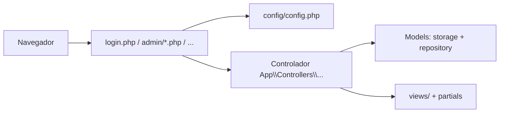

# Sistema Académico (PHP + JSON)

Aplicación web para gestión académica con **tres roles** (administrador, docente, estudiante). Persistencia en archivos **JSON** bajo `data/`. Interfaz con **Tailwind CSS** (CDN) y scripts auxiliares en `assets/js/`.

---

## Requisitos

- **PHP** 8.0+ (con sesiones habilitadas).
- Servidor web con PHP (por ejemplo **XAMPP**): el proyecto debe quedar bajo el document root, p. ej. `htdocs/Parcial2DeBa`.
- Navegador moderno (para Tailwind vía CDN).

**Acceso típico:** `http://localhost/Parcial2DeBa/` o `http://localhost/Parcial2DeBa/index.php`.

---

## Arquitectura general (MVC)

El proyecto sigue una separación **Modelo – Vista – Controlador** sin framework:

| Capa | Ubicación | Responsabilidad |
|------|-----------|-----------------|
| **Modelo** | `app/Models/` | Lectura/escritura de datos: archivos JSON (`storage.php`), consultas y reglas sobre esos datos (`repository.php`), catálogos y diccionarios (`data_dictionary.php`). |
| **Vista** | `views/` + `partials/` | HTML mezclado con PHP; presentación. `partials/header.php` y `footer.php` envuelven cada página. |
| **Controlador** | `app/Controllers/` | Clases en namespace `App\` que reciben la petición HTTP, aplican reglas de negocio y llaman a `render()` para mostrar una vista. |

**Utilidades transversales** (`app/Core/`):

- `helpers.php`: escape HTML (`h()`), URLs (`url()`, `asset_url()`), redirecciones, lectura de `$_POST`/`$_GET`, edad desde fecha, etc.
- `auth.php`: sesión, roles, login/logout, comprobación de credenciales contra JSON.

**Bootstrap:** `config/config.php` inicia sesión, define constantes de rutas (`ROOT_PATH`, `VIEWS_PATH`, `DATA_PATH`, …), registra el **autoload PSR-4** para `App\`, y carga Core + Models en el orden correcto.

La clase base `App\Controllers\Controller` expone `render($rutaRelativaViews, $arrayDatos)`, que hace `extract()` de los datos e incluye `header` → vista → `footer`.

---

## Flujo de una petición

1. El navegador solicita un **script público** en la raíz o en subcarpetas (`login.php`, `admin/materias.php`, etc.).
2. Ese script incluye **`config/config.php`** y ejecuta **un solo método**, normalmente `run()`, del controlador correspondiente.
3. El controlador puede:
   - comprobar rol (`require_role()`),
   - leer `POST`/`GET`,
   - invocar funciones del modelo (`load_data`, `save_data`, `repo_*`, etc.),
   - preparar variables y pasarlas a **`render('ruta/vista.php', [...])`**.
4. La **vista** en `views/` recibe esas variables y genera el HTML; el **header** usa `$pageTitle` y el usuario en sesión para la barra de navegación.

No hay front controller único: cada URL sigue mapeada a un archivo PHP concreto (adecuado para Apache/XAMPP sin reescritura de URLs).



---

## Estructura de directorios (resumen)

```
Parcial2DeBa/
├── config/
│   └── config.php          # Sesión, constantes, autoload, carga Core/Models
├── app/
│   ├── Core/               # helpers, auth
│   ├── Models/             # storage, repository, data_dictionary
│   └── Controllers/        # lógica por pantalla (namespace App\)
├── views/                  # Vistas por rol / módulo
├── partials/               # header.php, footer.php
├── admin/                  # Puntos de entrada administrador
├── docente/
├── estudiante/
├── data/                   # *.json (persistencia)
├── assets/                 # css/, js/
├── imagen/                 # Recursos estáticos (p. ej. carrusel admin)
├── index.php
├── login.php
└── logout.php
```

---

## Datos persistentes (`data/`)

Cada entidad principal tiene un archivo JSON (lectura/escritura vía `load_data` / `save_data`):

| Archivo | Contenido aproximado |
|---------|----------------------|
| `administradores.json` | Cuentas admin (correo + clave). |
| `docentes.json` | Docentes, programa, sede, credenciales. |
| `estudiantes.json` | Estudiantes y datos académicos/personales. |
| `materias.json` | Asignaturas, horarios, docente asignado, modalidad. |
| `matriculas.json` | Relación estudiante–materia. |
| `solicitudes.json` | Solicitudes del estudiante (tipos según diccionario). |

El archivo `data/.htaccess` (si está presente) ayuda a **no servir los JSON directamente** por URL en Apache.

---

## Autenticación y roles

- Tras un login correcto, `$_SESSION['user']` guarda `rol`, `id`, `nombre`, `identificador`.
- Roles: `administrador`, `docente`, `estudiante` (constantes en `auth.php`).
- **Administrador:** validación por **correo** y clave contra `administradores.json`.
- **Docente / estudiante:** validación por **documento o correo** y clave contra los JSON correspondientes.
- `require_role($rol)` obliga a estar logueado y con ese rol; si no, redirige a `login.php`.
- `dashboard_url_for_role()` envía al panel correcto según el rol.

---

## Mapa: entrada → controlador → vista

| URL (entrada) | Controlador | Vista principal |
|---------------|-------------|-----------------|
| `index.php` | `HomeController` | Redirige a login o al dashboard según sesión. |
| `login.php` | `LoginController` | `views/login.php` |
| `logout.php` | `LogoutController` | Cierra sesión y redirige al login. |
| `admin/dashboard.php` | `Admin\DashboardController` | `views/admin/dashboard.php` |
| `admin/materias.php` | `Admin\MateriasController` | `views/admin/materias.php` |
| `admin/docentes.php` | `Admin\DocentesController` | `views/admin/docentes.php` |
| `admin/estudiantes.php` | `Admin\EstudiantesController` | `views/admin/estudiantes.php` |
| `admin/matricular.php` | `Admin\MatricularController` | `views/admin/matricular.php` |
| `admin/reportes.php` | `Admin\ReportesController` | `views/admin/reportes.php` |
| `docente/dashboard.php` | `Docente\DashboardController` | `views/docente/dashboard.php` |
| `estudiante/dashboard.php` | `Estudiante\DashboardController` | `views/estudiante/dashboard.php` |

Los scripts en `admin/`, `docente/` y `estudiante/` son **delgados**: solo cargan configuración e invocan al controlador.

---

## Front-end y scripts

- **CSS:** `assets/css/main.css` (complementa Tailwind).
- **JS** (según pantalla): validaciones y UX en formularios admin, carrusel en el panel admin, credenciales demo en `localStorage` (`auth-credentials.js`; el login real lo valida el **servidor** con JSON).

Rutas a recursos estáticos se resuelven con `asset_url()` para que funcionen desde subcarpetas (`admin/`, etc.).

---

## Cómo estudiar o depurar el código

1. Elige una **URL** de la tabla anterior.
2. Abre el **controlador** en `app/Controllers/…` y sigue el método `run()`.
3. Revisa qué variables se pasan a `render()` y abre el archivo correspondiente en **`views/`**.
4. Para reglas de datos o IDs, entra en **`app/Models/repository.php`** y **`data_dictionary.php`**.
5. Para ver el formato guardado en disco, abre los archivos en **`data/`** (con el servidor detenido o copia de respaldo si vas a editarlos a mano).

---

## Pie de página y créditos

El texto del footer se define en `config/config.php` (`SITE_FOOTER_LINE`) y se muestra desde `partials/footer.php`.
