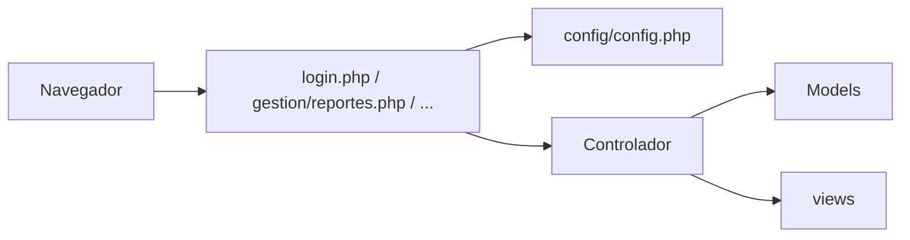

# Sistema Académico (PHP + JSON)

Hay **un solo flujo de acceso:** inicio de sesión y, para cualquier credencial válida, el **panel de gestión académica** (`gestion/dashboard.php`). No hay paneles separados por rol. Persistencia en **JSON** bajo `data/`. Interfaz con **Tailwind CSS** (CDN).

**Comportamiento actual:** el **inicio de sesión** valida contra `administradores`, `docentes` o `estudiantes` (en ese orden); el administrador gestiona solicitudes y datos maestros bajo `gestion/`; estudiantes y docentes tienen sus propios paneles (solicitudes, perfil, etc.).

---

## Requisitos

- **PHP** 8.0+ (con sesiones habilitadas).
- Servidor web con PHP (por ejemplo **XAMPP**): el proyecto debe quedar bajo el document root, p. ej. `htdocs/Parcial2DeBa`.
- Navegador moderno (para Tailwind vía CDN).

**Acceso típico:** `http://localhost/Parcial2DeBa/` o `http://localhost/Parcial2DeBa/index.php`.

---

## Arquitectura general (MVC)

| Capa | Ubicación | Responsabilidad |
|------|-----------|-----------------|
| **Modelo** | `app/Models/` | Lectura/escritura JSON (`storage.php`), consultas (`repository.php`), diccionarios (`data_dictionary.php`). |
| **Vista** | `views/` + `partials/` | HTML + PHP; `header.php` y `footer.php` envuelven cada página. |
| **Controlador** | `app/Controllers/` | Clases `App\…` con `run()` que llaman a `render()`. |

**Core** (`app/Core/`): `helpers.php` (URLs, `h()`, `post()`…), `auth.php` (sesión y login contra JSON).

**Servicio** (`app/Services/GestionAcademicaService.php`): reglas de alta/edición de estudiantes, docentes y asignaturas.

**Bootstrap:** `config/config.php` — sesión, constantes, autoload PSR-4 para `App\`, carga de Core y Models.

La clase `App\Controllers\Controller` define `render($rutaRelativaViews, $datos)` con `extract()` e incluye cabecera, vista y pie.

---

## Flujo de una petición

1. El navegador pide un script público (`login.php`, `gestion/reportes.php`, etc.).
2. El script carga `config/config.php` y ejecuta el `run()` del controlador.
3. El controlador puede aplicar `require_login()`, leer `POST`/`GET` y usar `load_data` / `save_data` según el módulo.
4. Se renderiza la vista en `views/`.



---

## Estructura de directorios (resumen)

```
Parcial2DeBa/
├── config/config.php
├── app/Core, app/Models, app/Controllers, app/Services
├── views/, partials/
├── gestion/        # Entradas PHP del panel (dashboard, reportes, CRUD…)
├── data/           # *.json
├── assets/css, assets/js
├── imagen/
├── index.php, login.php, logout.php
```

---

## Datos persistentes (`data/`)

| Archivo | Uso |
|---------|-----|
| `administradores.json` | Cuentas de acceso (correo + clave) y nombre. |
| `docentes.json` | Docentes (login con documento/correo + datos de listados). |
| `estudiantes.json` | Estudiantes (login + datos de formularios y reportes). |
| `solicitudes.json` | Solicitudes radicadas por estudiantes o docentes (trámites y estados). |

---

## Autenticación

- **Login:** usuario y contraseña. Se busca en orden: `administradores.json` (por correo), luego `docentes.json`, luego `estudiantes.json` (documento o correo + clave).
- Sesión: `$_SESSION['user']` con `id`, `nombre`, `identificador`. Tras iniciar sesión, las redirecciones van siempre a `gestion/dashboard.php`.
- Las páginas protegidas usan `require_login()` (cualquier usuario autenticado puede abrir las URLs bajo `gestion/`).

---

## Mapa: entrada → controlador → vista

| URL | Controlador | Vista / efecto |
|-----|-------------|----------------|
| `index.php` | `HomeController` | Redirige a login o al panel según sesión. |
| `login.php` | `LoginController` | `views/login.php` |
| `logout.php` | `LogoutController` | Cierra sesión. |
| `gestion/dashboard.php` | `Gestion\DashboardController` | `views/gestion/dashboard.php` (accesos + carrusel). |
| `gestion/reportes.php` | `Gestion\ReportesController` | `views/gestion/reportes.php` (listados). |
| `gestion/estudiantes.php`, `docentes.php`, `solicitudes.php` | `Gestion\*` | Formularios y listados en `views/gestion/`. |

---

## Front-end

- **CSS:** `assets/css/main.css`.
- **JS:** `panel-carrusel.js` (carrusel del inicio del panel), `docentes-form.js` (ayudas en formularios de docentes). El login se valida solo en servidor.

---

## Pie de página

`SITE_FOOTER_LINE` en `config/config.php`; se muestra en `partials/footer.php`.
